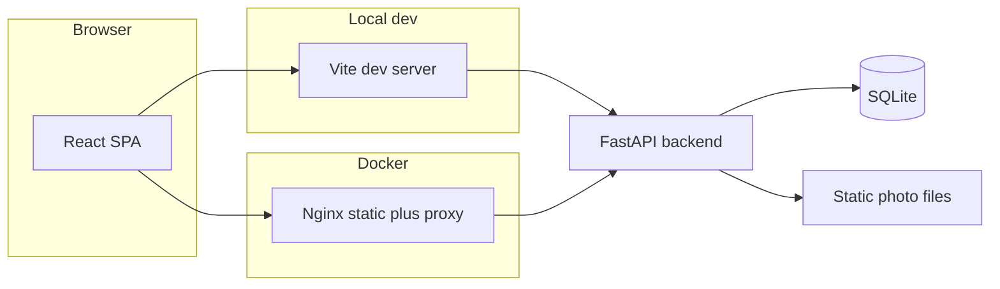

# Home Rental

Full-stack web application for a short-term apartment rental: public listing, photo gallery, date-based booking with availability calendar, guest accounts, and an admin workflow to confirm or cancel reservations. Built as a portfolio project demonstrating end-to-end product thinking, API design, and production-minded packaging (Docker, env-based config).

## Features

- **Public site** – Apartment details, amenities, contact info, featured hero image, responsive layout for desktop and mobile.
- **Gallery** – Browse apartment photos; lightbox navigation.
- **Booking** – Interactive calendar backed by availability API; guest form with validation; pricing summary; admin-only date blocking for maintenance.
- **Authentication** – Sign up / login for guests; separate admin login; passwords stored using **Argon2** hashing.
- **User dashboard** – Signed-in users can view current and past reservations.
- **Admin dashboard** – List and filter reservations; confirm or cancel; detail modal; transactional guest emails on status changes.
- **Email** – Guest submission / confirmation / cancellation and admin new-booking notifications via **Resend** (`RESEND_API_KEY`).
- **Containerized deployment** – Docker Compose for backend + frontend (Nginx serving the React build and proxying API routes).

## Tech stack

| Layer | Technologies |
|--------|----------------|
| **Backend** | Python, **FastAPI**, Uvicorn, **SQLAlchemy** ORM, Pydantic-style request/response schemas |
| **Database** | **SQLite** by default (`backend/home_rental.db`); |
| **Auth / security** | **Argon2** password hashing (`passlib` / `argon2-cffi`); session state for guests in `localStorage` for the SPA |
| **Frontend** | **React 19**, **Vite 7**, React Router, Axios |
| **Tooling** | ESLint (frontend); FastAPI auto-generated OpenAPI at `/docs` |
| **Ops** | **Docker Compose**, multi-stage frontend image with **Nginx** reverse proxy ([`frontend/nginx.conf`](frontend/nginx.conf)) |
| **Email** | **Resend** API ([`env.example`](env.example), [`DOCKER.md`](DOCKER.md)) |

## Architecture



- **Local development:** the Vite dev server proxies `/api`, `/apartment`, `/static`, and related paths to the backend ([`frontend/vite.config.js`](frontend/vite.config.js)).
- **Docker:** the frontend container serves the built SPA and proxies API traffic to the backend service ([`docker-compose.yml`](docker-compose.yml), [`DOCKER.md`](DOCKER.md)).

## Getting started

### Prerequisites

- **Python** 3.10+ recommended  
- **Node.js** 20+ (matches current Vite / React toolchain)  
- **Docker** (optional, for containerized run)

### Backend

```bash
cd backend
python -m venv .venv
# Windows: .venv\Scripts\activate
# macOS/Linux: source .venv/bin/activate
pip install -r requirements.txt
```

Copy environment template for email (optional but needed for real emails):

```bash
# From repo root: copy env.example to backend/.env and set RESEND_API_KEY / RESEND_FROM
```

Run the API (listens on `0.0.0.0:8000`):

```bash
python main.py
```

- Interactive API docs: [http://localhost:8000/docs](http://localhost:8000/docs)  
- Health check: [http://localhost:8000/health](http://localhost:8000/health)

### Frontend

```bash
cd frontend
npm install
npm run dev
```

Open the URL printed in the terminal (typically [http://localhost:5173](http://localhost:5173)). Keep the backend running on port **8000** so proxied API and static routes work.

```bash
npm run lint
```

### Docker (full stack)

From the repository root:

```bash
docker compose up --build
```

- Frontend (Nginx + built SPA): [http://localhost:3000](http://localhost:3000)  
- Backend API: [http://localhost:8000](http://localhost:8000)  

See [`DOCKER.md`](DOCKER.md) for `env_file`, volumes (`DATABASE_URL`, `STATIC_DIR`), and troubleshooting.

## Environment variables

| Variable | Where | Purpose |
|----------|--------|---------|
| `RESEND_API_KEY` | `backend/.env` (see [`env.example`](env.example)) | Send email via Resend |
| `RESEND_FROM` | `backend/.env` | From address for Resend (must be allowed in your Resend domain) |
| `DATABASE_URL` | Optional; Docker sets in `docker-compose.yml` | SQLAlchemy URL; default is SQLite under `backend/` |
| `STATIC_DIR` | Optional; Docker sets in `docker-compose.yml` | Directory for uploaded / served static photos |

Do not commit real secrets; keep them in `backend/.env` (gitignored) or your host’s secret store.

## Project structure

```
home-rental/
├── backend/           # FastAPI app, models, SQLite DB path, static photos
├── frontend/          # React (Vite) SPA
├── docker-compose.yml # Backend + frontend services
├── DOCKER.md          # Docker-specific notes
├── env.example        # Template for Resend / optional DB URL
└── README.md          # This file
```

## Testing and quality

- **Frontend:** `npm run lint` in `frontend/`.  
- **Backend:** no automated test suite in-repo yet; manual verification via `/docs` and UI flows is the current approach.

